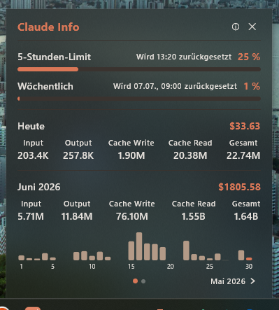

# Claude Info

Small tray tool that shows how many tokens Claude Code has used and what that would have cost in API usage.



## What's inside

- Usage: current day and the last three months. Each with a token breakdown (input, output, cache write 5 min + 1 h, cache read) and approximate USD costs.
- Hovering over the total shows a tooltip with the per-model cost breakdown.
- Prices are fetched from [LiteLLM](https://github.com/BerriAI/litellm).
- Usage updates continuously in the UI.
  - Token usage is read from the JSONL file every 10s. (Only the new tail segment is parsed, so it stays performant even with many sessions.)
  - Prices are fetched from the LiteLLM API every 60 min.
- Left-clicking the tray icon opens the UI in a popup with a native blur backdrop (Acrylic on Windows 10/11, NSVisualEffectView vibrancy on macOS, semi-transparent Compose fallback on Linux). X closes the window, the app keeps running in the tray. Right-click offers a "Start with Windows/macOS/Linux" toggle and the option to quit.
- Reads usage data exclusively from local `~/.claude/projects/**/*.jsonl`. No Anthropic API calls, no API key.

## Installation

Ready-made installers are available on the [releases page](https://github.com/PhilTdr/claude-info/releases):

| Platform | File |
|-----------|-------|
| Windows   | `ClaudeInfo-*.msi` |
| macOS (Apple Silicon) | `ClaudeInfo-*-arm64.dmg` |
| macOS (Intel) | `ClaudeInfo-*-x64.dmg` |
| Linux (Debian/Ubuntu) | `claude-info_*.deb` |

### First launch

- **Windows**: SmartScreen popup → "More info" → "Run anyway". The installer dialog lists `treder.dev Apps` as the publisher.
- **macOS**: A double-click is blocked. Right-click the `.app` → "Open" → "Open" again. macOS remembers this per machine.
- **Linux**: `sudo dpkg -i claude-info_*.deb`. Whether the tray icon actually shows up depends on the desktop environment.

## For developers

You need JDK 17+ with `JAVA_HOME` set. CI runs on JDK 21.

```bash
./gradlew :desktopApp:hotRun --auto                    # Hot-reload development
./gradlew :desktopApp:run                              # Normal start
./gradlew :shared:jvmTest                              # Tests
./gradlew :desktopApp:packageDistributionForCurrentOS  # Distribution (DMG / MSI / DEB)
```

### Tech stack

Kotlin with Compose Multiplatform (JVM target for desktop)
Material 3
Ktor (CIO) for the LiteLLM pricing fetch
kotlinx-serialization / -datetime for date and JSON handling
Tray integration via `java.awt.SystemTray` + `PopupMenu`
The native blur backdrops use JNA: on Windows `user32!SetWindowCompositionAttribute` is called, on macOS an `NSVisualEffectView` is wrapped and the Metal clear color is made transparent via Skiko reflection. Signing happens in CI with jsign (Windows) and `codesign` (macOS).

### Architecture

Clean Architecture, MVVM, Repository Pattern.

```
shared/commonMain/      domain (models, repository interfaces)
                        data/aggregation (pure aggregator)
                        presentation (ViewModel, Compose UI)
shared/jvmMain/         ClaudeInfoApp (manual DI)
                        JSONL parser & tail cache
                        pricing fetch (Ktor) + refresh loop
                        settings.json reader
desktopApp/             main.kt (window setup, focus loss)
                        backdrop/ (Windows / macOS / Linux fallback)
                        tray/ (SystemTray + AWT menu)
```

### Data source

Token usage: the source is the `~/.claude/projects/**/*.jsonl` files. Per line, only completed assistant responses count, i.e. `type == "assistant"` with `message.stop_reason` set. Streaming intermediates are ignored, otherwise they would be counted twice.
Model prices: the source is [LiteLLM](https://github.com/BerriAI/litellm).
